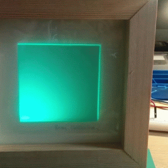
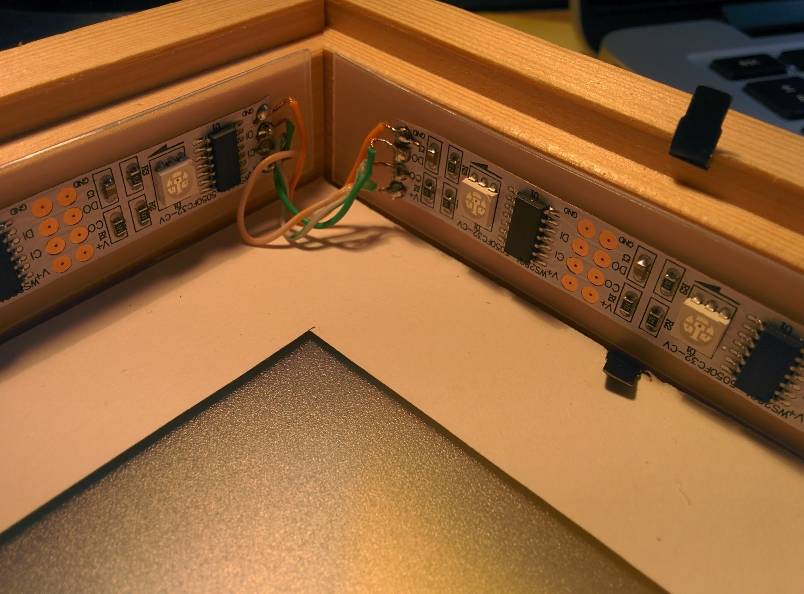

A Raspberry Pi powered LED picture frame.

The LED's are placed around the inside rim and are used to illuminate the inside area with any colour.

There are 3 LED's per side, each an RGB WS2801 type.

# Schematic

TODO

But heres an insider view:

